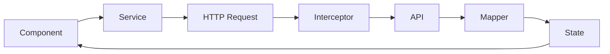

Cinemusic follows a structured architecture that separates concerns between presentation (UI) and business logic (domain). This organization makes the codebase maintainable and scalable.

## Project structure

The application is organized into two main directories:

<CardGroup cols={2}>
  <Card title="ui/" icon="palette">
    Contains all presentation layer components, pages, layouts, and animations
  </Card>
  <Card title="domain/" icon="cube">
    Contains business logic, services, state management, models, and mappers
  </Card>
</CardGroup>

### UI layer

The UI layer is further organized into specific responsibilities:

```
ui/
├── pages/              # Feature pages and containers
│   ├── music/          # Music-related pages
│   └── series/         # Series-related pages
├── components/         # Reusable UI components
├── layouts/            # Layout components (nav-bar-main)
└── animations/         # Animation utilities
```

#### Pages structure

Pages represent complete features and are organized by domain:

<Tabs>
  <Tab title="Music pages">
    - `section-main-music` - Main music landing page
    - `container-bento-grid-music` - Grid layout for music content
    - `section-play-list-songs` - Playlist management
    - `music-player` - Audio player component
    - `add-song-to-list` - Add songs to playlists
    - `formulary-create-list-music` - Create new playlists
  </Tab>
  <Tab title="Series pages">
    - `container-scroll-series` - Scrollable series list
    - `section-gender-series` - Series filtered by genre
    - `serie-selected-view` - Individual series detail view
    - `container-information-series` - Series metadata display
  </Tab>
</Tabs>

#### Components

The app includes reusable components for forms, buttons, and SVG icons:

- **Form components**: `input-form-generic`, `input-search-generic`, `select-options`
- **Button components**: `button-generic`
- **Icon components**: 25+ SVG components (play, pause, heart, search, etc.)

### Domain layer

The domain layer contains all business logic and is organized by responsibility:

```
domain/
├── models/             # TypeScript interfaces and types
│   ├── music/          # Music domain models
│   └── series/         # Series domain models
├── services/           # API and business logic services
│   ├── music/          # Music-related services
│   └── series/         # Series-related services
├── states/             # RxJS-based state management
├── mappers/            # Data transformation logic
│   ├── music/          # Music data mappers
│   └── series/         # Series data mappers
├── interceptors/       # HTTP interceptors
└── pipes/              # Custom Angular pipes
```

<Note>
  The domain layer is completely independent of the UI layer, making business logic easy to test and reuse.
</Note>

## Layer responsibilities

<AccordionGroup>
  <Accordion title="Models - Data structures">
    Define TypeScript interfaces and enums for type safety throughout the application.
    
    Located in `domain/models/`, these files define the shape of data used across the app.
    
    Example: `Artis`, `Song`, `PlayList`, `Gender`, `Category`, `Series`
  </Accordion>
  
  <Accordion title="Services - Business logic">
    Handle API communication and business operations using Angular's dependency injection.
    
    Services use `HttpClient` to fetch data from JSON files and provide observables for async operations.
    
    Example services:
    - `artist.service.ts` - Artist data operations
    - `music-data-service.service.ts` - Centralized music data management
    - `gender.service.ts` - Genre operations
  </Accordion>
  
  <Accordion title="States - State management">
    Manage application state using Angular signals and RxJS observables.
    
    State services provide reactive data streams that components can subscribe to.
    
    Example: `StatesNavbarMainService` manages navigation menu visibility
  </Accordion>
  
  <Accordion title="Mappers - Data transformation">
    Transform raw API responses into strongly-typed domain models.
    
    Mappers ensure data consistency and handle JSON-to-TypeScript conversion.
    
    Example:
    - `MapperArtist` - Converts JSON to `Artis` interface
    - `SongMapper` - Converts JSON to `Song` interface
  </Accordion>
  
  <Accordion title="Interceptors - HTTP middleware">
    Process HTTP requests and responses globally.
    
    - `error.interceptor.ts` - Global error handling
    - `mapper.interceptor.ts` - Automatic data transformation
  </Accordion>
</AccordionGroup>

## Data flow

The typical data flow in Cinemusic follows this pattern:



1. **Component** requests data from a service
2. **Service** makes HTTP request via `HttpClient`
3. **Interceptor** processes the request/response
4. **Mapper** transforms JSON to TypeScript models
5. **State** updates with new data
6. **Component** receives updated data through observables/signals

## Best practices

<CardGroup cols={2}>
  <Card title="Separation of concerns" icon="layer-group">
    Keep UI components focused on presentation. Move business logic to services.
  </Card>
  <Card title="Type safety" icon="shield">
    Use TypeScript interfaces from domain/models for all data structures.
  </Card>
  <Card title="Reactive patterns" icon="bolt">
    Leverage RxJS observables and Angular signals for reactive state management.
  </Card>
  <Card title="Lazy loading" icon="rocket">
    Components are lazy-loaded via routing to improve initial load time.
  </Card>
</CardGroup>