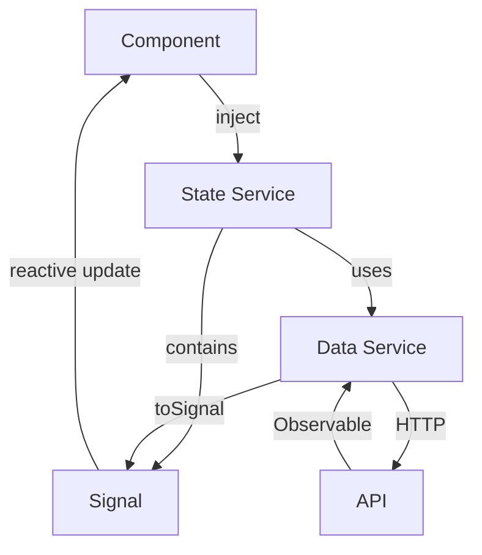

Cinemusic uses a reactive state management approach built on Angular signals and RxJS observables. This pattern provides type-safe, reactive data streams throughout the application.

## State management pattern

The application uses services in `domain/states/` to manage shared state. These services combine Angular's signal API with RxJS for reactive programming.

<CardGroup cols={2}>
  <Card title="Angular signals" icon="bolt">
    Provide fine-grained reactivity with automatic change detection
  </Card>
  <Card title="RxJS observables" icon="stream">
    Handle async operations and complex data streams
  </Card>
</CardGroup>

## State service example

Here's how Cinemusic implements state management:

```typescript states-navbar-main.service.ts
import { Injectable, signal, WritableSignal } from '@angular/core';

@Injectable({
  providedIn: 'root'
})
export class StatesNavbarMainService {

  public activateMenu: WritableSignal<boolean> = signal<boolean>(false);

  public switchMenu(value: boolean): void {
    this.activateMenu.set(value);
  }
}
```

This service manages the navigation menu's visibility state using Angular signals:

<AccordionGroup>
  <Accordion title="Signal declaration">
    ```typescript
    public activateMenu: WritableSignal<boolean> = signal<boolean>(false);
    ```
    
    Creates a writable signal with an initial value of `false`. Components can read this signal to know if the menu is open.
  </Accordion>
  
  <Accordion title="State mutation">
    ```typescript
    public switchMenu(value: boolean): void {
      this.activateMenu.set(value);
    }
    ```
    
    Provides a method to update the signal. This triggers automatic change detection in all components reading this signal.
  </Accordion>
  
  <Accordion title="Singleton service">
    ```typescript
    @Injectable({
      providedIn: 'root'
    })
    ```
    
    The `providedIn: 'root'` ensures only one instance exists app-wide, making state truly shared.
  </Accordion>
</AccordionGroup>

## Music data state management

The `MusicDataService` demonstrates a more complex state management pattern with automatic refresh capabilities:

```typescript music-data-service.service.ts
import { effect, inject, Injectable, signal, WritableSignal } from '@angular/core';
import { MusicService } from './music.service';
import { Song } from '../../models/music/songs';
import { toSignal } from '@angular/core/rxjs-interop';
import { Observable, Subject, switchMap } from 'rxjs';
import { Gender } from '../../models/music/gender';
import { ListSongs, PlayList } from '../../models/music/play-list';
import { Artis } from '../../models/music/artis';

@Injectable({
  providedIn: 'root'
})
export class MusicDataService {

  private musicService: MusicService = inject(MusicService);

  public songMostListened = this.createSignalWithRefresh<Song>(
    () => this.musicService.apisSongs.getSongMostListened(),
    {} as Song
  );

  public newSong = this.createSignalWithRefresh<Song>(
    () => this.musicService.apisSongs.getSongNew(),
    {} as Song
  );

  public songsHistory = this.createSignalWithRefresh<Song[]>(
    () => this.musicService.apisSongs.getAllHistory(),
    []
  );

  public allSongs = this.createSignalWithRefresh<Song[]>(
    () => this.musicService.apisSongs.getAll(),
    []
  );

  public getAllListSongs = this.createSignalWithRefresh<ListSongs[]>(
    () => this.musicService.apisListSongs.getAll(),
    []
  );

  private createSignalWithRefresh<T>(source$: () => Observable<T>, initial: T) {
    const refreshTrigger = new Subject<void>();

    const sig = toSignal(
      refreshTrigger.pipe(
        switchMap(() => source$())
      ),
      { initialValue: initial }
    );

    const refresh = () => refreshTrigger.next();
    refresh();

    return { signal: sig, refresh };
  }
}
```

### Signal with refresh pattern

The `createSignalWithRefresh` method creates a powerful pattern that combines signals and observables:

<Tabs>
  <Tab title="How it works">
    1. **Subject as trigger**: Creates a `Subject` to manually trigger data refreshes
    2. **switchMap operator**: Switches to the latest observable when triggered
    3. **toSignal conversion**: Converts the observable to a signal for reactive templates
    4. **Auto-refresh**: Calls `refresh()` immediately to load initial data
    5. **Return object**: Returns both the signal (for reading) and refresh function (for updating)
  </Tab>
  
  <Tab title="Usage in components">
    ```typescript
    import { Component, inject } from '@angular/core';
    import { MusicDataService } from './domain/services/music/music-data-service.service';
    
    @Component({
      selector: 'app-music-list',
      template: `
        <div *ngFor="let song of musicData.allSongs.signal()">
          {{ song.name }}
        </div>
        <button (click)="refreshSongs()">Refresh</button>
      `
    })
    export class MusicListComponent {
      musicData = inject(MusicDataService);
      
      refreshSongs() {
        this.musicData.allSongs.refresh();
      }
    }
    ```
  </Tab>
  
  <Tab title="Benefits">
    - **Type safety**: Full TypeScript support with generics
    - **Automatic updates**: Components update automatically when data changes
    - **Manual refresh**: Can trigger data reload on demand
    - **Initial load**: Data loads immediately on service initialization
    - **Memory efficient**: Uses signals for optimal change detection
  </Tab>
</Tabs>

## State management architecture



## Available state properties

The `MusicDataService` exposes these reactive state properties:

<AccordionGroup>
  <Accordion title="songMostListened">
    **Type**: `Signal<Song>`
    
    **Purpose**: Tracks the most listened song for display on the home screen
    
    **Usage**:
    ```typescript
    const topSong = musicData.songMostListened.signal();
    ```
  </Accordion>
  
  <Accordion title="newSong">
    **Type**: `Signal<Song>`
    
    **Purpose**: Latest released song for the "New Music" section
    
    **Usage**:
    ```typescript
    const latestSong = musicData.newSong.signal();
    ```
  </Accordion>
  
  <Accordion title="songsHistory">
    **Type**: `Signal<Song[]>`
    
    **Purpose**: User's listening history for recently played tracks
    
    **Usage**:
    ```typescript
    const history = musicData.songsHistory.signal();
    ```
  </Accordion>
  
  <Accordion title="allSongs">
    **Type**: `Signal<Song[]>`
    
    **Purpose**: Complete catalog of available songs
    
    **Usage**:
    ```typescript
    const songs = musicData.allSongs.signal();
    ```
  </Accordion>
  
  <Accordion title="getAllListSongs">
    **Type**: `Signal<ListSongs[]>`
    
    **Purpose**: All user-created playlists with their songs
    
    **Usage**:
    ```typescript
    const playlists = musicData.getAllListSongs.signal();
    ```
  </Accordion>
  
  <Accordion title="getDataPlayList">
    **Type**: `Signal<PlayList>`
    
    **Purpose**: Playlist metadata (total songs, favorites count)
    
    **Usage**:
    ```typescript
    const playlistInfo = musicData.getDataPlayList.signal();
    ```
  </Accordion>
  
  <Accordion title="getArtirstMostListened">
    **Type**: `Signal<Artis>`
    
    **Purpose**: Most popular artist based on play counts
    
    **Usage**:
    ```typescript
    const topArtist = musicData.getArtirstMostListened.signal();
    ```
  </Accordion>
  
  <Accordion title="getGenderMostListened">
    **Type**: `Signal<Gender>`
    
    **Purpose**: Most popular music genre
    
    **Usage**:
    ```typescript
    const topGenre = musicData.getGenderMostListened.signal();
    ```
  </Accordion>
</AccordionGroup>

## Reading state in components

You can consume state in two ways:

<Tabs>
  <Tab title="In templates">
    ```typescript
    @Component({
      selector: 'app-songs',
      template: `
        <h2>All Songs</h2>
        <div *ngFor="let song of musicData.allSongs.signal()">
          {{ song.name }} - {{ song.artist }}
        </div>
      `
    })
    export class SongsComponent {
      musicData = inject(MusicDataService);
    }
    ```
    
    Call the signal as a function in templates to get the current value.
  </Tab>
  
  <Tab title="In component code">
    ```typescript
    @Component({
      selector: 'app-songs',
      template: '...'
    })
    export class SongsComponent implements OnInit {
      musicData = inject(MusicDataService);
      
      ngOnInit() {
        // Read current value
        const songs = this.musicData.allSongs.signal();
        console.log(`Total songs: ${songs.length}`);
        
        // Use effect for reactive updates
        effect(() => {
          const songs = this.musicData.allSongs.signal();
          console.log('Songs updated:', songs);
        });
      }
    }
    ```
    
    Use Angular's `effect()` to react to signal changes in component code.
  </Tab>
</Tabs>

## Updating state

<Tabs>
  <Tab title="Simple state update">
    ```typescript
    // For simple boolean/string states
    statesNavbar = inject(StatesNavbarMainService);
    
    openMenu() {
      this.statesNavbar.switchMenu(true);
    }
    
    closeMenu() {
      this.statesNavbar.switchMenu(false);
    }
    ```
  </Tab>
  
  <Tab title="Refresh data state">
    ```typescript
    // For data loaded from API
    musicData = inject(MusicDataService);
    
    reloadSongs() {
      this.musicData.allSongs.refresh();
    }
    
    reloadPlaylists() {
      this.musicData.getAllListSongs.refresh();
    }
    ```
  </Tab>
  
  <Tab title="Mutate operations">
    ```typescript
    // For operations that modify data
    musicData = inject(MusicDataService);
    
    createPlaylist(playlist: any) {
      this.musicData.createNewListSongs(playlist).subscribe(() => {
        // Refresh the playlists after creation
        this.musicData.getAllListSongs.refresh();
      });
    }
    
    deleteSong(songId: string, listId: string) {
      this.musicData.deleteSongOfList(songId, listId);
      // Refresh to show updated list
      this.musicData.getAllListSongs.refresh();
    }
    ```
  </Tab>
</Tabs>

## Best practices

<CardGroup cols={2}>
  <Card title="Keep state in services" icon="database">
    Never manage shared state in components. Use injectable services with `providedIn: 'root'`.
  </Card>
  <Card title="Use signals for sync data" icon="bolt">
    Prefer signals over BehaviorSubject for simple state like boolean flags or selected items.
  </Card>
  <Card title="Use observables for async" icon="stream">
    Use RxJS observables for HTTP requests and complex async operations.
  </Card>
  <Card title="Immutable updates" icon="lock">
    Always create new objects/arrays when updating state rather than mutating existing ones.
  </Card>
  <Card title="Type everything" icon="code">
    Use TypeScript interfaces for all state to catch errors at compile time.
  </Card>
  <Card title="Refresh after mutations" icon="refresh">
    Call `refresh()` after operations that modify data to keep UI in sync.
  </Card>
</CardGroup>

<Note>
  The combination of signals and observables provides the best of both worlds: fine-grained reactivity with signals and powerful async handling with RxJS.
</Note>